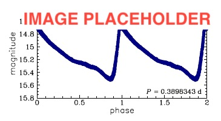

.. rrlyrae_metallicity documentation master file, created by
   sphinx-quickstart on Sat Aug 11 19:54:07 2018.
   You can adapt this file completely to your liking, but it should at least
   contain the root `toctree` directive.

Documentation for RR Lyrae metallicity calibration
=============================================================

.. toctree::
   :maxdepth: 2
   :caption: Get started

   introduction
   installation

.. toctree::
   :maxdepth: 2
   :caption: Tutorials

   tutorial1
   tutorial2
   acknowledgements

.. toctree::
   :maxdepth: 8
   :caption: Modules

   rrlyrae_metallicity

Indices and tables
==================

* :ref:`genindex`
* :ref:`modindex`
* :ref:`search`
